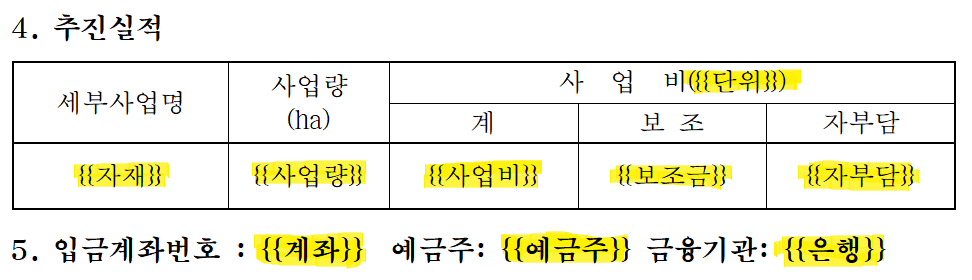

# 추가로 있으면 좋을 이미지 목록

> 매뉴얼 (`사용자매뉴얼.html`)에 더 넣으면 좋겠다 싶은 이미지들 정리.
> **필수 아님** — 시간 될 때 추가하면 매뉴얼 가독성과 안내 정확도가 더 올라간다.
> 이미지는 모두 `docs/manual/attachments/` 폴더에 저장.

---

## 우선순위 ⭐⭐⭐ (있으면 큰 도움)

### 1. 한글 양식 안에 치환 키가 들어간 예시
- **파일명**: `attachments/양식_치환키_예시.png`
- **위치**: §7.2 치환 키 작성 규칙 (현재 `pre/code` 텍스트 예시 뒤에)
- **무엇**: 한글 프로그램(또는 한컴오피스)에서 신청서 양식 문서를 열고, 본문에 `{{성명}}`, `{{주소}}`, `{{사업비}}` 등이 자연스럽게 들어가 있는 모습. 한 페이지 정도면 충분.
- **이유**: 사용자가 "치환 키를 양식 어디에 어떻게 넣는지" 글로만 보면 감이 안 올 수 있음. 실제 한글 화면 캡쳐 1장이면 즉시 이해됨.
- **HTML 추가 위치**:
  ```
  §7.2 치환 키 작성 규칙
  → "예시 ─────────" 코드블록 다음
  → figure 추가
  ```

---

### 2. 미인식 치환 키 경고 표시 클로즈업
- **파일명**: `attachments/미인식_치환키_경고.png`
- **위치**: §7.5 미인식 치환 키 경고
- **무엇**: 신청서 작성 화면에서 양식을 선택했는데, 양식 트리 카드 하단에 **"⚠️ 미인식 치환키 2개"** + 노란 배지로 `{{잘못된키}}`가 표시된 모습. 카드 부분만 잘라낸 클로즈업이면 충분.
- **이유**: 사용자가 직접 양식을 만들 때 자주 마주칠 화면. 어떻게 생겼는지 미리 보여주면 당황하지 않음.
- **HTML 추가 위치**:
  ```
  §7.5 미인식 치환 키 경고
  → "양식을 선택하면..." 문장 뒤
  → callout 위에 figure 추가
  ```

---

## 우선순위 ⭐⭐ (있으면 좋음)

### 3. forms 폴더 구조 (Windows 탐색기)
- **파일명**: `attachments/forms_폴더_구조.png`
- **위치**: §7.4 양식 파일 저장 위치
- **무엇**: Windows 탐색기에서 `forms/` 폴더를 열어 `담당과 → 사업종류 → 양식.hwpx` 2단계 구조가 보이는 화면. 트리 펼친 상태로 캡쳐.
- **이유**: 폴더 구조를 텍스트로 보여줘도 직접 보는 게 명확함.
- **HTML 추가 위치**:
  ```
  §7.4 양식 파일 저장 위치
  → 코드블록(forms/...) 다음
  → "폴더 구조는 정확히 2단계" callout 위에
  ```

---

### 4. 프리셋 관리 / 신규 프리셋 작성 다이얼로그
- **파일명**: `attachments/프리셋_관리.png`
- **위치**: §4.1 일괄조회 (프리셋 선택 설명 부분)
- **무엇**: 일괄조회 화면에서 **서식 관리** 버튼을 눌렀을 때 뜨는 다이얼로그. 프리셋 목록과 신규 프리셋 작성 화면.
- **이유**: 직접 프리셋 만들고 싶은 사용자에게 도움.
- **HTML 추가 위치**:
  ```
  §4.1 1단계: 엑셀 업로드 + 프리셋 선택
  → 3번 항목 "직접 만들고 싶으면 서식 관리" 다음
  → figure 추가
  ```

---

### 5. 메모 입력 모습 (자동 저장 강조)
- **파일명**: `attachments/메모_입력.png`
- **위치**: §3.2 결과 확인 + 상세 보기
- **무엇**: 농업인 상세 화면에서 메모 카드 부분만 클로즈업. 글이 입력되어 있는 상태.
- **이유**: 메모 기능 자체를 모르는 사용자도 있음. 캡쳐로 강조하면 인지도 향상.
- **HTML 추가 위치**:
  ```
  §3.2 결과 확인 + 상세 보기
  → "메모 기능" callout 위 또는 옆
  ```

---

## 우선순위 ⭐ (선택 — 작은 개선)

### 6. 데이터 내보내기 버튼 강조
- **파일명**: `attachments/내보내기_버튼.png`
- **위치**: §3.3 데이터 내보내기
- **무엇**: 농업인 상세 화면 하단의 **데이터 내보내기** 버튼 부분만 작게 잘라낸 캡쳐 (또는 화살표·테두리로 강조).
- **이유**: 위치를 직관적으로 알려줌. 작은 부분 강조용.
- **HTML 추가 위치**:
  ```
  §3.3 데이터 내보내기
  → 본문 위
  ```

---

### 7. 신청서 액션 바 (하단 버튼들)
- **파일명**: `attachments/액션바_개별.png`, `attachments/액션바_일괄.png`
- **위치**: §5.5 / §6.4 신청서 생성
- **무엇**: 화면 하단의 [초기화 / 신청서 생성 / 생성 후 실행 / 생성 후 출력] 버튼 부분만 캡쳐.
- **이유**: 어디 있는지 위치 강조. 표만으로는 위치가 헷갈릴 수 있음.

---

## HTML 반영 방법

이미지를 attachments에 추가한 뒤, `사용자매뉴얼.html`의 해당 위치에 다음 형태로 삽입:

```html
<figure>
  
  <figcaption>한글 양식 본문에 치환 키가 들어간 모습</figcaption>
</figure>
```

각 이미지는 클릭하면 자동으로 라이트박스로 확대됩니다. 별도 작업 불필요.

---

## 정리

| # | 이미지 | 우선순위 | 매뉴얼 섹션 |
|---|---|---|---|
| 1 | 양식_치환키_예시.png | ⭐⭐⭐ | §7.2 치환 키 작성 |
| 2 | 미인식_치환키_경고.png | ⭐⭐⭐ | §7.5 미인식 경고 |
| 3 | forms_폴더_구조.png | ⭐⭐ | §7.4 저장 위치 |
| 4 | 프리셋_관리.png | ⭐⭐ | §4.1 일괄조회 |
| 5 | 메모_입력.png | ⭐⭐ | §3.2 상세 화면 |
| 6 | 내보내기_버튼.png | ⭐ | §3.3 |
| 7 | 액션바_개별/일괄.png | ⭐ | §5.5 / §6.4 |

**최우선 추천**: ⭐⭐⭐ 2장만 추가해도 매뉴얼 가독성 크게 개선됨. 특히 #1 (한글에서 치환 키 들어간 모습)이 가장 핵심.
